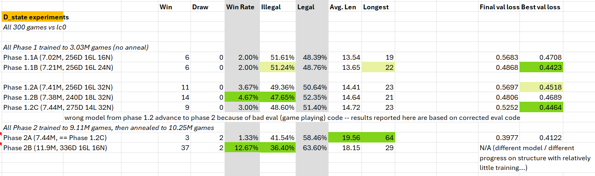
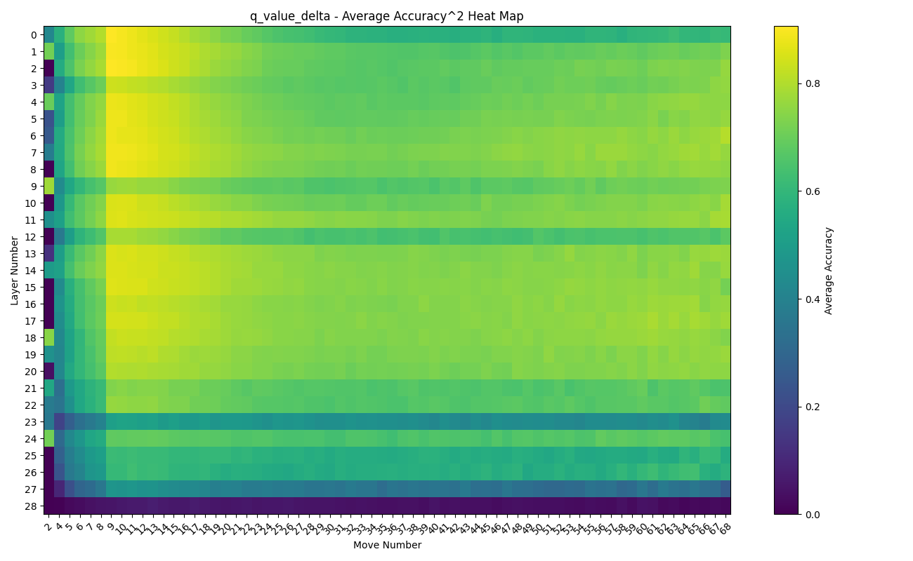

# **Exploring Mamba's Capabilities with Chess: Ablations, Probing Inner States, and Transformer Comparisons**

## 1. Introduction
### 1.1 Background
Neural network models have significantly advanced various fields, including natural language processing and game playing. Traditional chess engines like Stockfish rely on handcrafted evaluation functions and brute-force search techniques. In contrast, neural network-based models learn to evaluate positions and make decisions from large datasets. A key area of interest is whether next-token-predicting (language) models, which learn from raw game data without annotations of position strengths or reinforcement learning/self-play, can perform well in chess. This provides insights into the capabilities of different neural network architectures.

### 1.2 Motivation and Objectives
The primary motivation for this project arose from my fascination with the [Mamba architecture](https://arxiv.org/abs/2312.00752), which was released shortly before Adam Karvonen's first article on chess models. Adam's experiments demonstrated the robust internal state of a Transformer based language model, and I was inspired to investigate whether the Mamba architecture could match or exceed the performance of Transformer models in this domain.

I first ran a small experiment, training an 11M parameter Mamba model on 18.8M games. I announced these results on [X/Twitter](https://x.com/HaileyStormC/status/1764148850384892394). My model achieved 37.7% win rate vs Stockfish skill level 0; by comparison, a 25M version of Adam's Transformer model reached < 20% win rate after ~20M games. However, my model was a different size from Adam's, used a different dataset, different hyperparamter schedule, and more - there was no direct comparison between the architectures, only a basic demonstration that Mamba as a language model could effectively learn to play chess.

Having seen my initial results, [Jason](https://twitter.com/KamaraiCode) reached out and offered to sponsor compute for a more direct and detailed comparison of the architectures. Along with a new game format, tokenizer and loss calculation adjustments, I set out to train 50M parameter Mamba and Transformer models using identical hyperparameters and schedules, in order to create a true apples-to-apples comparison of the internal state and learning capabilities of the Mamba and Transformers architectures.

Adam Karvonen's initial work, detailed in his reports [Chess World Models](https://adamkarvonen.github.io/machine_learning/2024/01/03/chess-world-models.html) and [Chess GPT Interventions](https://adamkarvonen.github.io/machine_learning/2024/03/20/chess-gpt-interventions.html), served as a foundation and inspiration for this project.

## 2. Dataset and Tokenizer Improvements
### 2.1 Dataset Overview
Adam's original model was trained using games created by pitting Stockfish against itself. He found this approach outperformed games pulled from a Lichess dataset. However, his dataset had every game with white playing at a skill level of approximately 3200 ELO, presumably making it more difficult for models to learn, especially in the early stages. Additionally, the Stockfish dataset had around 97% white wins, while the Lichess dataset only had around 70%.

### 2.2 Data Filtering and Preparation
To address this, I created two datasets by filtering Lichess data. The datasets were split into 'stable' and 'anneal' parts to gradually increase difficulty during training:

- **First Dataset:**
  - Stable: 19.1M games, white ELO 1300-2300, black 1300-2700
  - Anneal: 3.5M games, white 1900-2300, black 1300-2600
- **Second Dataset:**
  - Stable: 46.8M games, white 1500-2400, black 1400-2800
  - Anneal: 5.77M games, white 2000-2500, black 1500-3000

100% of the games in my dataset had white wins. The games were converted to Parquet files, sorted by game length, and split into smaller files to ensure efficient VRAM use and minimal padding during training.

### 2.3 Tokenizer Adjustments
Adam's tokenizer used the Movetext of the PGN format, excluding the result and any comments. Each unique character received an integer token, resulting in a dictionary size of 32. I modified this approach:
- Removed move numbers
- Removed dashes from castling notation
- Removed the ';' token, used to separate games (sequences are always single games)

Together, this reduced the dictionary size to 28 by eliminating tokens for '0', '9', '-', and ';'.

This more efficient representation allowed for longer games within the context size and more efficient training.

## 3. d_Model Configuration Experiments and Scaling Analysis

In the course of developing the Mamba 50M model, a series of experiments were conducted to determine the optimal configuration of d_state, d_model, and layer count. These experiments were critical in understanding the architecture's performance and informed the development of three versions of the Mamba 50M model.

### 3.1 Initial Versions: v1 and v2

The first version of the Mamba 50M model (v1) was configured with 48 layers, a d_model of 384, a d_state of 32, and a dt_rank of 56. My confidence was not high, but v1 demonstrated remarkably poor performance in evaluations. This unexpected result prompted a deeper investigation into the model's configuration.

In response, a series of d_state ablation experiments were designed to systematically vary the d_state and layer count, aiming to identify configurations that might improve performance. The second version (v2) was developed based on preliminary insights from these ablations. v2 featured 19 layers, a d_model of 640, a d_state of 28, and an auto dt_rank of 40. However, due to the evaluation bug (discussed in Section 6.1), the performance improvements were not as significant as anticipated.

### 3.2 d_state Ablation Experiments

The d_state ablation experiments were conducted in two phases:

#### Phase 1.1: Initial d_state Variations

1. **Model 1.1A**: 16 layers, d_model 256, d_state 16
2. **Model 1.1B**: 16 layers, d_model 256, d_state 24

**Phase 1.1 Results**:
- Models were trained to 3.03M games.
- Model 1.1B showed a slight improvement in legal moves, though the difference was small. Its final loss was also lower. This provides some evidence for the value of higher d_state.

#### Phase 1.2: Higher d_state with Similar Parameter Count

1. **Model 1.2A**: 16 layers, d_model 256, d_state 32
3. **Model 1.2B**: 18 layers, d_model 240, d_state 32
4. **Model 1.2C**: 14 layers, d_model 275, d_state 32

**Phase 1.2 Results**:
- Models were trained to 3.03M games.
- Model 1.2B demonstrated the best performance among these configurations, indicating the importance of layer count.
- Model 1.2A's superior performance to 1.1B - with the same configuration other than higher d_state - strengthens the argument in favor of higher d_state values.

#### Phase 2: Higher d_state vs Larger Model

1. **Model 2A**: Model 1.2C advanced from Phase 1.2
2. **Model 2B**: 16 layers, d_model 336, d_state 16

**Phase 2 Results**:
- Models were trained to 9.11M games and then annealed to 10.25M games.
- Model 2B, the larger model, significantly outperforms the smaller model with high d_state, especially by win rate. This speaks to the importance of layer count (16 vs 14), and, given 1.2A had the same layer count, especially of d_model (336 vs 275).
- The relatively similar illegal move rate, and model 2A's longer games, do strengthen the argument for higher d_state when possible / within reason. This is reinforced by the ranking of the Phase 1.2 models.

Due to the evaluation bug, the wrong model (C) from Phase 1.2 advanced to Phase 2, leading to suboptimal parameter choices for 50M v2. However, once the bug was fixed, a more accurate assessment of the configurations was possible, leading to the development of the final version, v3.

The detailed results of the d_state ablation experiments are summarized in the following table:

*Figure 1: Results of the d_state ablation experiments, showing the performance of various model configurations. Corrected results shown.*

### 3.3 Final Version: v3

Based on the corrected evaluations and insights from the ablation experiments, the final version of the Mamba 50M model (v3) was configured with 29 layers, a d_model of 512, a d_state of 32, and an auto dt_rank of 32. This version showed significant improvements over the previous versions, with better performance in win rate, legal moves, and other key metrics.

The final Mamba 50M model was selected based on a combination of empirical performance data from the ablation experiments, my previous Mamba models, and the the [Mamba Othello work by alxndrTL](https://github.com/alxndrTL/othello_mamba), along with theoretical considerations and imperical data from the Mamba paper.

*Figure 2: Evaluation results for the three versions of the Mamba 50M model. Version 3 clearly outperforms versions 1 and 2, demonstrating the effectiveness of the final configuration.*

### 3.4 Performance Comparison: Mamba 50M vs. Mamba 280M

To further investigate the scaling properties of the Mamba architecture, a 280M parameter model was trained and compared to the final 50M model. The 280M model was configured with 40 layers, a d_model of 1024, a d_state of 64, and a dt_rank of 72.

The performance comparison between the Mamba 50M and 280M models up to 39.5M games is shown in the following chart. The 280M model consistently outperformed the 50M model on all three metrics: win rate, percentage of legal moves, and percentage of games lost due to illegal moves. 

*Figure 3: Training performance comparison between Mamba 50M and Mamba 280M models up to 39.5M games. The 280M model shows superior performance across all key metrics.*

It is important to note that the 280M model has not followed the same hyperparameter and dataset schedule as the 50M model. This model has not completed training.

### Note on Evaluation Engine

For evaluating the models' performance, I used the lc0 chess engine, which is faster than Stockfish. Lc0 utilizes a neural network to evaluate the strength of any given position and employs Monte Carlo Tree Search (MCTS) to determine the best move. Unless otherwise stated, all results are shown against an lc0 network that is slightly weaker than Stockfish level 0.

## 4. Model Training and Hyperparameters
### 4.1 Training Setup
The initial hyperparameters were largely based on Adam's model:
- Effective batch size: 100
- Beta2: 0.95
- Weight decay: 4.5e-3
- Learning rate: 3e-4
- Auto grad clip percentile: 10.0

I implemented a version of AutoClip, as described in [AutoClip: Adaptive Gradient Clipping for Source Separation Networks](https://arxiv.org/abs/2007.14469). This technique involves tracking total gradient norms over a rolling window and updating the clipping value based on the percentile of the gradient norms. This approach helps stabilize training by preventing excessively large gradient updates and has been shown to speed up training.

The Warmup-Stable-Decay (WSD) learning rate schedule, as described in [MiniCPM: Unveiling the Potential of Small Language Models with Scalable Training Strategies](https://arxiv.org/abs/2404.06395), was chosen for its flexibility and potential to speed up training.

### 4.2 Hyperparameter Tuning and Adjustments
Hyperparameter adjustments were made based on training metrics and model evaluations:
- **At 22M games:** Beta2: 0.925, Weight decay: 1.25e-4, Learning rate: 2e-4
- **At 33.2M games:** Beta2: 0.9125, Weight decay: 1e-4, Learning rate: 1.75e-4, Grad clip percentile: 9.0, added the first 'anneal' dataset
- **At 58.1M games:** Switched to the second 'stable' dataset
- **At 67.9M games:** Annealed to a learning rate of 1e-5
- **At 76.9M games:** Maintained learning rate at 1e-5, continued annealing
- **At 86M games:** Deeper anneal with a minimum learning rate of 3.3333e-7

During each anneal phase, the following additional parameter adjustments were made:
- Weight decay divided by 12.5
- Beta2 set to sqrt(beta2)*beta2
- Grad clip percentile set to 6.75

These adjustments aimed to slow learning appropriately and match the increased difficulty of the dataset, ensuring the models continued to improve.

Reviewing results and logs after the fact, in particular slow evaluation metric improvement and steady or increasing total gradient norm (in spite of clipping to a percentile), I do belive I lowered the learning rate too much at 22M games and especially at 33.2M games. The anneal at 67.9M games therefore likely came too early as well.

### 4.3 Training Process
The dataset was preprocessed to prepare for its use in both Mamba and Transformer models, minimize padding and stabilize VRAM use; this involved sorting the tokenized games by length and splitting into numerous small files.

During training, games in each batch were padded to the length of the longest game in the batch. The loss was calculated using the actual padded batch, not including logits beyond the longest game in the batch, so that training updates for both models were based the same number of games/tokens and not based on excessive padding.

To further facilitate apples-to-apples comparison between the Mamba and Transformer models, the number of actual game tokens seen and the total tokens seen (including padding) were tracked. This tracking ensured that both models trained on an equivalent amount of data.

The training script randomly selected a file from the preprocessed dataset, changing files every batch (100 games). Changing files, and therefore game lengths, too frequently was found to result in GPU crashes.

This meticulous approach to data handling and loss calculation allowed for a fair comparison between the models, ensuring that any observed performance differences were due to the architectures and not discrepancies in the training process.

### 4.4 Training Logs and Tracking
Weights and Biases (W&B) was used to track loss and gradient norms. Key observations from W&B helped in deciding when to run evaluations and make hyperparameter adjustments.

## 5. Evaluation Metrics and Performance Analysis
### 5.1 Primary and Secondary Metrics
A modified version of Adam's evaluation script was used for the models to play against Stockfish and lc0 chess engines and record statistics. The primary evaluation metric was the win rate. Secondary metrics included:
- Percentage of moves which are illegal/legal
- Percentage of games lost due to 5x illegal attempts

Attempts per illegal move, average and average first illegal attempt move number, average number of moves per game, and longest game were recorded for completeness but were not considered as significant indicators of model performance.

### 5.2 Performance Comparison
Mamba consistently outperformed Transformer throughout the training interval on win rate, was close but usually ahead on lost to illegal, and often ahead on legal moves %. The first two charts illustrate the training performance at various checkpoints against lc0. Detailed results of the evaluation of the final checkpoints against Stockfish level 0 are shown in the last table.

*Figure 4: Training performance comparison between Mamba and Transformer models over 97.4M games. The Mamba model shows superior performance in terms of win rate and legal moves percentage.*

*Figure 5: Saturation region towards the end of training where both models show slow improvement. Mamba maintains a higher win rate and lower percentage of games lost to illegal moves.*

*Figure 6: Evaluation results of the Mamba and Transformer 50M models at 76.9M games (after the first anneal) and 97.4M games (after the second anneal). These evaluations, conducted against Stockfish level 0 over 1000 games, provide a detailed view of the models' performance. At both checkpoints, Mamba outperforms Transformer on every key metric: win rate, illegal attempts, illegal moves, attempts per illegal move, and percentage of games lost due to 5x illegal attempts.*

### 5.3 Random Moves Experiment
Adam Karvonen's initial experimentation with random moves involved starting games with 20 random opening moves, resulting in a significant performance drop, with the win rate against Stockfish level 0 falling from 69.6% to 16.7%. This highlighted the challenge of generalizing from training data when faced with atypical game play, while demonstrating *some* generalization capability.

Building on this idea, I tested how different numbers of random opening moves affected model performance. Specifically, I tested 5, 10, 15, 20, 25, 30, and 35 random opening moves, and also inserted 10 random moves at various stages in the game, starting from moves 0, 5, 10, 15, 20, and 25.

Interestingly, my results showed a significantly less dramatic reduction in performance. For instance, with 20 random opening moves, the win rate of my Transformer model against lc0 dropped from 71.2% to 42.4%, while Mamba's win rate decreased from 74.9% to 45.6%. This suggests better generalization from the training data despite the random moves.

I attribute this improved generalization to the cleaner and appropriately scaled dataset used in my experiments. Additionally, using Lichess data instead of Stockfish data introduced a greater variety in play styles, likely aiding the models' adaptation to random scenarios.

The similar impact of random moves on both models further demonstrates the stability of Mamba's internal state and highlights the competitiveness of its architecture.

Below are the results of the random moves experiments, showing performance degradation with different numbers and stages of random moves:

*Figure 7: Performance impact of varying numbers of random opening moves. Mamba maintains an edge in win rate, though the gap narrows as the number of random moves increases.*

*Figure 8: Performance impact of inserting 10 random moves at different points in the game. Both models perform worst when random moves are added at the start, with improvements as the random moves are added later in the game.*

## 6. Contrastive Activation and Linear Probes
### 6.1 Contrastive Activation
Contrastive activation involved storing layer activations, split by move number bucket and game won/lost. During evaluation, the average of these stored activations from lost games is subtracted from the average of activations from won games, multiplied by a weight factor and added to the current layer activations to encourage the model to play more like it does when it wins. The results were mixed, with slight improvements in some scenarios. Better results could likely be achieved by searching for and applying different weights by layer number, move bucket and number of random opening moves.

*Figure 9: Testing different weights for contrastive activation. The best performance was observed with a weight factor of 0.8.*

*Figure 10: Performance comparison with and without contrastive activation across varying numbers of random opening moves. Contrastive activation shows mixed results, with some improvement at specific points.*

### 6.2 Linear Probes
Linear probes were trained to investigate the internal state representations of the Mamba model. Three types of probes were used, targeting:
- The q-value (lc0's evaluation of player position strength) after Mamba's most recent move
- The delta in q-value from before to after Mamba's most recent move
- The net material balance, calculated with 1 point per pawn, 3 per knight or bishop, etc.

To determine correlations between these targets, 1500 games were analyzed, and heatmaps were generated to visualize the absolute correlations (the layer numbers are not import here):

*Figure 11: Correlation between q-value and q-value delta. Strong correlation observed, especially after move 15. This was intially surprising, but likely indicates both lc0 and Mamba play ~consistently between games and (especially after move 15) within games.*

*Figure 12: Correlation between q-value delta and material balance. Minimal correlation, as expected.*

*Figure 13: Correlation between q-value and material balance. Minimal correlation, as expected.*

The probes were then trained on 14k games and evaluated on 5k games. The following heatmaps show the accuracy and accuracy raised to a power to highlight differences in higher accuracy:

*Figure 14: Accuracy of the q-value probe across layers and move numbers.*

*Figure 15: Accuracy squared of the q-value probe across layers and move numbers.*

*Figure 16: Accuracy of the q-value delta probe across layers and move numbers. Patterns similar to q-value, with slightly higher overall accuracy*

*Figure 17: Accuracy squared of the q-value delta probe across layers and move numbers.*

*Figure 18: Accuracy of the material balance probe across layers and move numbers.*

*Figure 19: Accuracy to the fifth power of the material balance probe across layers and move numbers. High accuracy overall.*

The results indicate that the Mamba model tracks position strength effectively and provide evidence that it tracks board state / piece positions. Furthermore, the accuracy at layer zero (some of the game) and the scattered layers with low accuracy without transitions in accuracy to/from these layers indicate the Mamba model is able to build and use these representations within a single layer.

## 7. Challenges and Lessons Learned
### 7.1 Evaluation Bug and Its Impact
One significant challenge was an evaluation bug in the script that adapted Mamba models to Adam's chess-playing script for playing against Stockfish and lc0. The bug, specific to my new 28-token tokenizer, caused the token for 'c' to be used incorrectly, impacting the models' apparent performance. Specifically, the models' win rates and illegal move rates initially declined and then plateaued very early and fluctuated strangely, leading to misleading conclusions about their training progress.

This bug was particularly problematic because after seeming to point at issues with model configuration, leading me to run the d_state ablation experiments, it caused me to use an exceptionally low learning rate in those experiments and to advance the wrong model from phase 1.2 to phase 2. Consequently, incorrect parameter choices were made for the second version of the Mamba 50M model.

Once the bug was fixed, all evaluations were redone (where checkpoints were still available), revealing the true performance of the models. The third and final Mamba 50M model, configured largely based on proper evaluation results, showed significant improvement over the previous versions.

### 7.2 Lessons for Mamba Model Configuration
The experiments conducted provide strong evidence that the Mamba architecture is capable of learning and generalizing from raw game data, largely surpassing Transformer models in this domain. One key lesson from this work, supported by both my ablations and the findings from Mamba Othello project, is the importance of adjusting the number of layers based on the architecture. A general rule derived from these experiments is to start with the number of layers a Transformer would use and multiply by 2, then reduce slightly to accommodate a higher d_state and maintain or exceed the d_model of the Transformer model.

This approach ensures that the Mamba models have a sufficient width and dimensionality to develop a robust internal state and sufficient depth to track variables across long sequences, while also balancing the computational cost of increased d_model and especially d_state parameters. The evidence from the linear probes further supports the conclusion that Mamba's internal state is well-developed and capable of tracking key aspects of the game, such as position strength and board state.

### 7.3 Hyperparameter Schedule Insights
As detailed in Section 4.2, reviewing results and logs indicated some of the.

Despite these potential refinements, the training evaluations indicate that use of AutoClip and a verion of the Warmup-Stable-Decay (WSD) learning rate schedule contributed to achieving models of similar strength to Adam's original model while training on significantly less data (34.8B tokens vs. 61.4B). This provides evidence supporting the effectiveness of these methods, including their use with the Mamba architecture, though future work should focus on refining hyperparameter schedules to further enhance training performance.

## 8. Future Work and Conclusions
### 8.1 Future Directions
Plans for continuing training the 280M model are in place. There is also interest in exploring more complex probe targets, such as individual piece positions on the board.

### 8.2 Conclusions
The Mamba architecture consistently outperformed Transformer models in chess, demonstrating higher win rates, lower rates of illegal attempts, and robust learning capabilities. Throughout training, Mamba maintained a superior win rate, underscoring its effective learning and ability to generalize from diverse training data.

Both Mamba and Transformer models experienced similar performance declines when random moves were introduced, which suggests that Mamba's ability to generalize is comparable to that of Transformer models. This similarity in performance decline between the models helps validate Mamba's stable internal state and competitiveness as architecture.

Ablation experiments were crucial in determining effective model configurations, particularly for d_state, d_model, and the number of layers. These experiments, along with the successful training of the v1, v2, and v3 50M models and the initial performance of the 280M model, provided valuable insights into configuring Mamba models, as discussed in Sections 3 and 7.2.

Linear probing revealed Mamba's ability to track game state (roughly, as proxied by material balance) and position strength. Although these probes were relatively simple compared to Adam's, they confirmed the model's accurate predictions of material balance and position strength, showcasing its capacity to learn and represent complex game dynamics.

Along with optimizations to the tokenizer and the dataset itself, the choice of hyperparameter and dataset schedule led to models of similar strength to Adam's original model while training on significantly less data (34.8B tokens vs 61.4B). While it's challenging to precisely attribute the success to each factor, this provides evidence supporting the effectiveness of these methods.

While the findings from this project are promising and provide some guidance for future Mamba model configurations, they are based largely on chess and rather small 50M parameter models. Future work with larger models and different domains is necessary to fully validate Mamba's potential and refine its training strategies.

### 8.3 Acknowledgments
A big thank you to [Jason](https://twitter.com/KamariCode),for sponsoring the compute resources necessary for this project. Your support has been invaluable.

Additionally, I extend my gratitude to [Adam Karvonen](https://twitter.com/a_karvonen) for the inspiration drawn from your experiments. Your work laid the foundation for this project.

Thank you also to [Nathan Labenz](https://twitter.com/labenz) for mentioning my initial Mamba model on his podcast The Cognitive Revolution.

## References
- [Chess World Models by Adam Karvonen](https://adamkarvonen.github.io/machine_learning/2024/01/03/chess-world-models.html)
- [Chess GPT Interventions by Adam Karvonen](https://adamkarvonen.github.io/machine_learning/2024/03/20/chess-gpt-interventions.html)
- [Evaluation the Mamba architecture on the Othello game](https://github.com/alxndrTL/othello_mamba)
- [AutoClip: Adaptive Gradient Clipping for Source Separation Networks](https://arxiv.org/abs/2007.14469)
- [MiniCPM paper](https://arxiv.org/abs/2404.06395)

## Training Logs

**Mamba 50M Weights and Biases Logs:**

- [Run 1](https://wandb.ai/haileycollet/chess-mamba-v3/runs/kcxmusjv)
- [Run 2](https://wandb.ai/haileycollet/chess-mamba-v3/runs/q67og8ud)
- [Run 3](https://wandb.ai/haileycollet/chess-mamba-v3/runs/wcmo5odg)
- [Run 4](https://wandb.ai/haileycollet/chess-mamba-v3/runs/o0zyoj70)
- [Run 5](https://wandb.ai/haileycollet/chess-mamba-v3/runs/llkufjyw)
- [Run 6](https://wandb.ai/haileycollet/chess-mamba-v3/runs/it1vin7r)
- [Run 7](https://wandb.ai/haileycollet/chess-mamba-v3/runs/atrpslhr)
- [Run 8](https://wandb.ai/haileycollet/chess-mamba-v3/runs/tcr2gkox)
- [Run 9](https://wandb.ai/haileycollet/chess-mamba-v3/runs/esct2bwv)
- [Run 10](https://wandb.ai/haileycollet/chess-mamba-v3/runs/ys2ou1sh)
- [Run 11](https://wandb.ai/haileycollet/chess-mamba-v3/runs/a6gbczo1)
- [Run 12](https://wandb.ai/haileycollet/chess-mamba-v3/runs/cbvthgqi)
- [Run 13](https://wandb.ai/haileycollet/chess-mamba-v3/runs/lajis4g4)
- [Run 14](https://wandb.ai/haileycollet/chess-mamba-v3/runs/662ee7cj)
- [Run 15](https://wandb.ai/haileycollet/chess-mamba-v3/runs/6219wgpz)
- [Run 16](https://wandb.ai/haileycollet/chess-mamba-v3/runs/p9xsd1dr)
- [Run 17](https://wandb.ai/haileycollet/chess-mamba-v3/runs/j2ydsdxa)
- [Run 18](https://wandb.ai/haileycollet/chess-mamba-v3/runs/mroy0q0p)
- [Run 19](https://wandb.ai/haileycollet/chess-mamba-v3/runs/22t44xfv)
- [Run 20](https://wandb.ai/haileycollet/chess-mamba-v3/runs/q0go4atq)
- [Run 21](https://wandb.ai/haileycollet/chess-mamba-v3/runs/or2cg4g3)
- [Run 22](https://wandb.ai/haileycollet/chess-mamba-v3/runs/wajys295)
- [Run 23](https://wandb.ai/haileycollet/chess-mamba-v3/runs/07n5pzxg)
- [Run 24](https://wandb.ai/haileycollet/chess-mamba-v3/runs/1v9dqk5v)
- [Run 25](https://wandb.ai/haileycollet/chess-mamba-v3/runs/rslpqpq9)
- [Run 26](https://wandb.ai/haileycollet/chess-mamba-v3/runs/lj0bwrcf)

**Mamba 280M Weights and Biases Logs:**

- [Run 1](https://wandb.ai/haileycollet/chess-mamba-YOLO/runs/ftjvc0jv)
- [Run 2](https://wandb.ai/haileycollet/chess-mamba-YOLO/runs/in4f7s02)
- [Run 3](https://wandb.ai/haileycollet/chess-mamba-YOLO/runs/pk1k5eye)
- [Run 4](https://wandb.ai/haileycollet/chess-mamba-YOLO/runs/x7n99c24/)
- [Run 5](https://wandb.ai/haileycollet/chess-mamba-YOLO/runs/fg1xyxyn)
- [Run 6](https://wandb.ai/haileycollet/chess-mamba-YOLO/runs/jgzsj7yb)
- [Run 7](https://wandb.ai/haileycollet/chess-mamba-YOLO/runs/j0148kq0)
- [Run 8](https://wandb.ai/haileycollet/chess-mamba-YOLO/runs/b3xigxta)
- [Run 9](https://wandb.ai/haileycollet/chess-mamba-YOLO/runs/lfpigopk)

**Transformer 50M Weights and Biases Logs:**

- [Run 1](https://wandb.ai/haileycollet/chess-xformer/runs/6tkw1r9t)
- [Run 2](https://wandb.ai/haileycollet/chess-xformer/runs/425p8zg7)
- [Run 3](https://wandb.ai/haileycollet/chess-xformer/runs/fhd0icm2)
- [Run 4](https://wandb.ai/haileycollet/chess-xformer/runs/r7wwzxnt)
- [Run 5](https://wandb.ai/haileycollet/chess-xformer/runs/8agxuryr)
- [Run 6](https://wandb.ai/haileycollet/chess-xformer/runs/g66ur23r)
- [Run 7](https://wandb.ai/haileycollet/chess-xformer/runs/1gk6a1vl)
- [Run 8](https://wandb.ai/haileycollet/chess-xformer/runs/k1pb39yz)

## Similar Models and Relevant Work

The exploration of next-token prediction models in chess is a developing field. Here's a list of relevant works and models that have contributed to this domain:

- [Ricson Cheng's Transformers Play Chess](https://arxiv.org/abs/2008.04057)
- [Ranlp-1.153](https://aclanthology.org/2021.ranlp-1.153/)
- [Another Transformer-based Chess Model](https://ar5iv.labs.arxiv.org/html/2102.13249)
- [Ricson Cheng's GitHub Repository](https://github.com/ricsonc/transformers-play-chess)
- [A Very Unlikely Chess Game](https://slatestarcodex.com/2020/01/06/a-very-unlikely-chess-game/)

--
- [Approximate Methods - Chess](https://approximatemethods.com/chess.html#fn2)
- [Vinod's Chess Transformers](https://github.com/sgrvinod/chess-transformers)
- [Adam Karvonen's First Article](https://adamkarvonen.github.io/machine_learning/2024/01/03/chess-world-models.html)
- [Adam Karvonen's Second Article](https://adamkarvonen.github.io/machine_learning/2024/03/20/chess-gpt-interventions.html)

Above the line, the models are not rated and are clearly below 1200 ELO, with most performing under 800 ELO. The last entry is Adam's model, which achieved a 69.6% win rate against Stockfish level 0. The second-to-last model is competitive with Adam's, beating Stockfish Fairy level 5 approximately 55% of the time, corresponding to an ELO of around 1514. The most notable model in terms of potential state-of-the-art (SOTA) performance is a T5-Small with 60M parameters, trained on board-move pairs rather than full game strings. Although not thoroughly rated, it is estimated to have a win rate under 85% against Stockfish level 0, under 70% against level 1, under 50% against level 2, and under 30% against level 3, placing its ELO between 1575 and 1675.

## Dataset, Code and Hyperparameters
- [HuggingFace Repo, with code, config files, and model checkpoints](https://huggingface.co/HaileyStorm/chess-mamba-vs-xformer)
- [HuggingFace Dataset, with csv games in my simplified PGN format, filtered from Lichess as described in Section 2.2](https://huggingface.co/datasets/HaileyStorm/lichess-filtered)
